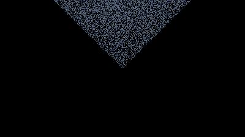

# RT — Ray Tracer in Node.js

Custom ray-tracing renderer with a unique ray–triangle intersection algorithm (not based on Möller–Trumbore). Built as an experimental MVP.



## Features
- Written in Node.js
- Basic rendering of a single triangle
- Custom intersection logic using implicit triangle representation
- Pixel output to image

## Getting Started

### Prerequisites
- Node.js (v18+ recommended)

### Install & Run
```bash
git clone https://github.com/grzesiekmq/rt.git
cd rt
node app.js  
```
The result will be saved to image.jpg.

## Triangle Intersection

This project implements a minimal custom ray–triangle intersection without relying on standard algorithms like Möller–Trumbore. Triangle is represented implicitly and tested directly.

## Project Status

> ⚠️ Early MVP — Functional but minimal. Only basic rendering of a triangle works.


## Related Projects

implicit-RT-triangle — Lua prototype (Love2D) using same intersection logic


## License

ISC
